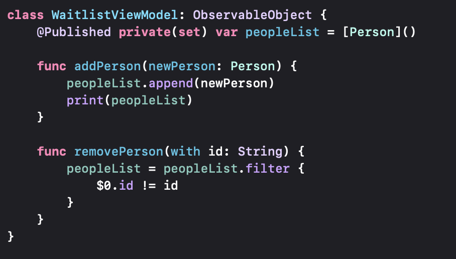
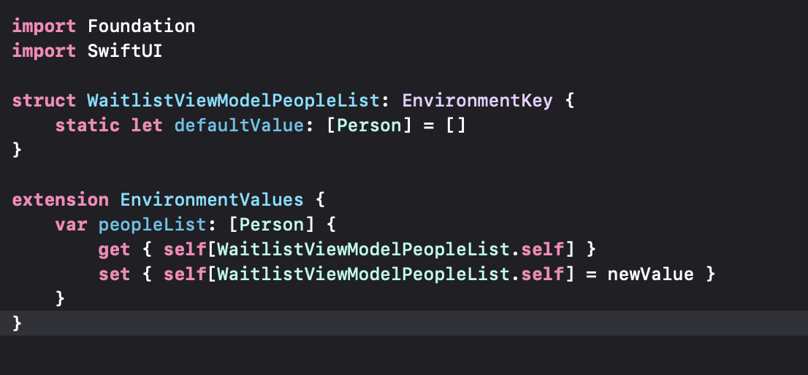
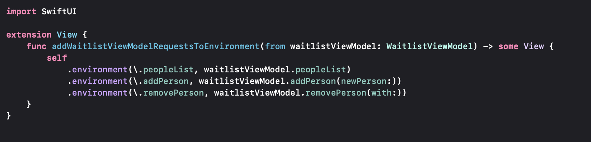
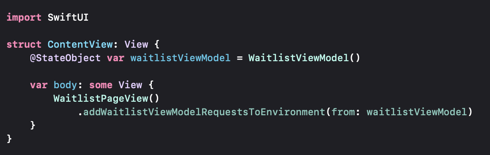
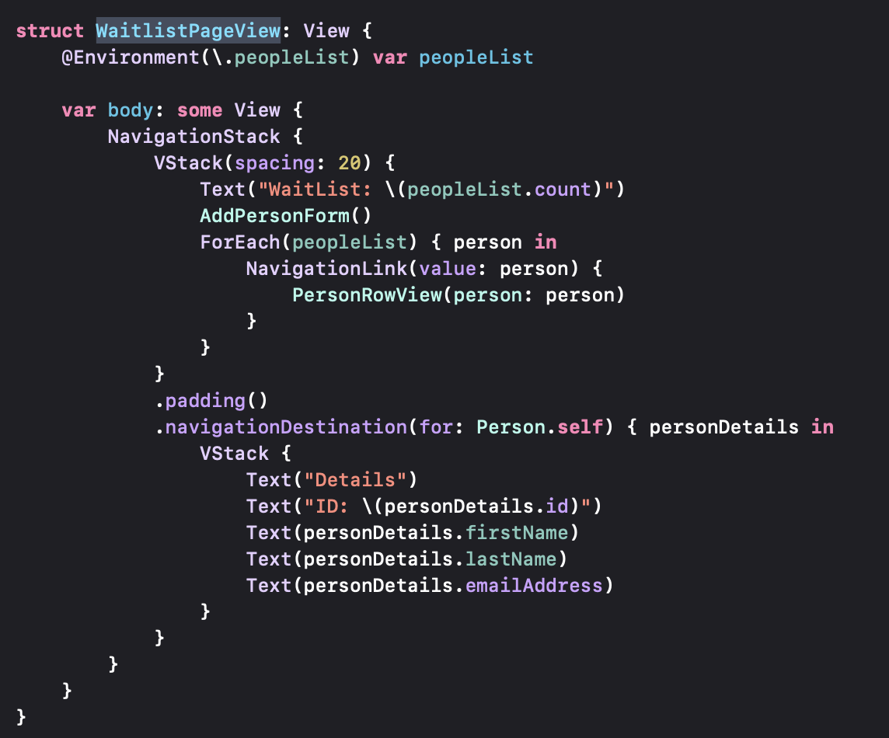
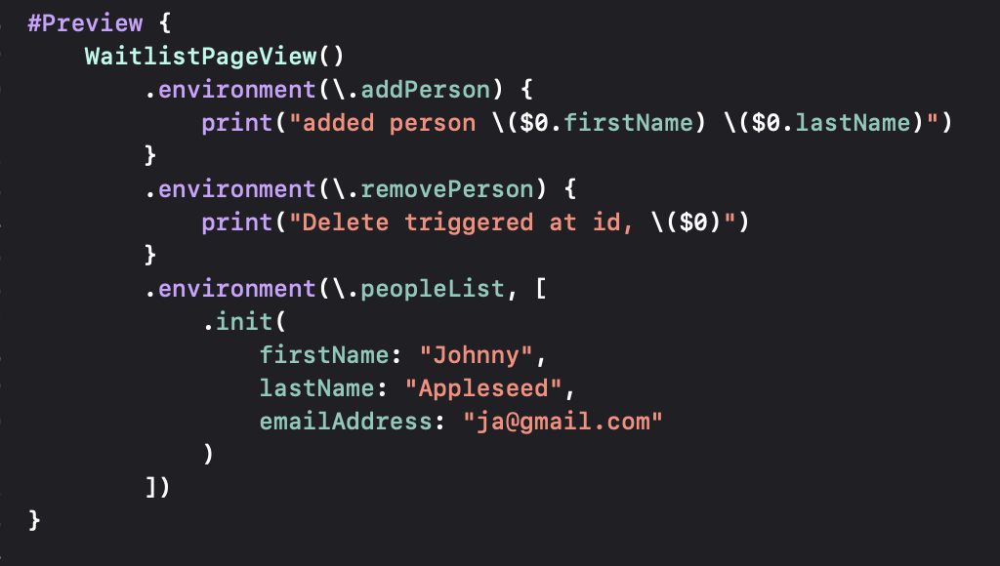

# Waitlist

This project is used for demonstration of a dependency injection pattern that is able to
easily mock the minimal data/functionalities needed for a particular SwiftUI view and would
therefore allow SwiftUI previews to be used seamlessly with minimal effort.

Traditionally, a view would need to access an entire ViewModel class in order to access
published values or mutating functions. Mocking a ViewModel especially for a SwiftUI preview
can be convoluted, especially if you do not want networking implementation to run in this context.

The proposed solution is in short, to extract functionalities and data of a ViewModel
to unit-sized chunks that can be ingested by child views without needing the whole ViewModel
class. The strategy depicts as following:

1. Decide a piece of data or function from your ViewModel that you'd like to extract:

2. Register your data/function to an environment key that SwiftUI will understand in a global context:

The default value of the environment key as well as your environment value should conform to 
the type of your data/function (WaitlistViewModel.peopleList)

3. Create a view extension function that will ingest the View Model itself and then set the data/functionalities to
their corresponding environment keys. Create the association of your new environmentKey value to their 
corresponding data/function from your ViewModel:

4. At the top level of your app, instantiate your View Model state object and pass it down to an invocation
of your new function from the view extension (from step 3):

5. It's time to use your newly extracted unit of data/function! Open an existing/children view where you would
like to invoke this.

Access your data piece with the Environment property wrapper and the corresponding environment key value.
Use the variable like any other piece of data/function would be used.

6. In your current SwiftUI preview, you can mock that exact unit of data/function as well as any others that
your view may have access to in its sub views as the following:

For development purposes with SwiftUI views, the actual functionalities of the ViewModel will not be used, but
whatever you specify will be used! This is great for easily seeing changes on your view, quickly iterating, and
you won't have to invoke any business logic, networking or side effects that would otherwise complicate your workflow.

That's it!
